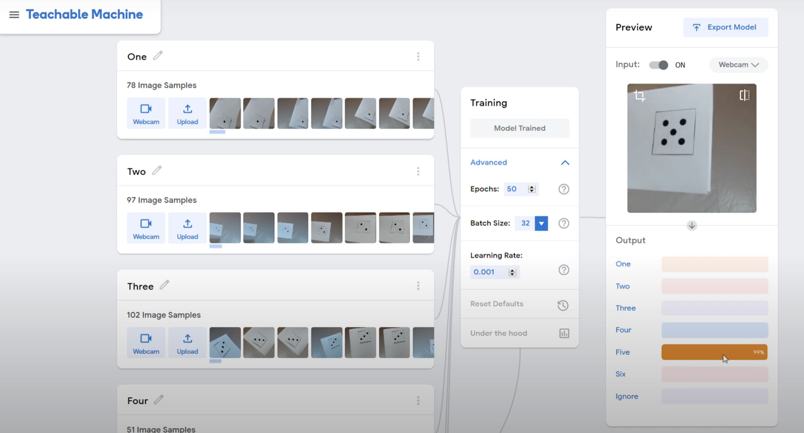
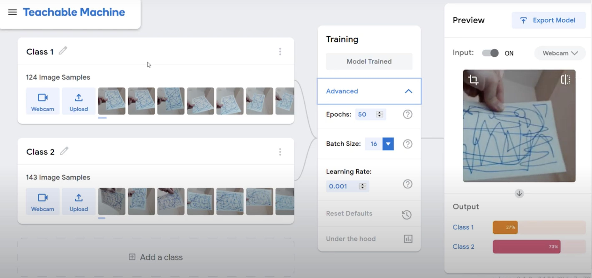

Use Reinforcement Learning to train a TensorFlow model to recognize new objects.

With these two experemints, I explore Reinforcement Learning using TensorFlow.js to train an existing model on how to 1) recognize the six sides of a dice and to 2) recognize random scribbles apart.

# 1) Identify The Six Faces Of a Dice: https://youtu.be/ztLTs8Y4ttM

# 2) Identify Random Scribbles: https://youtu.be/gaK89Frg5Zs

